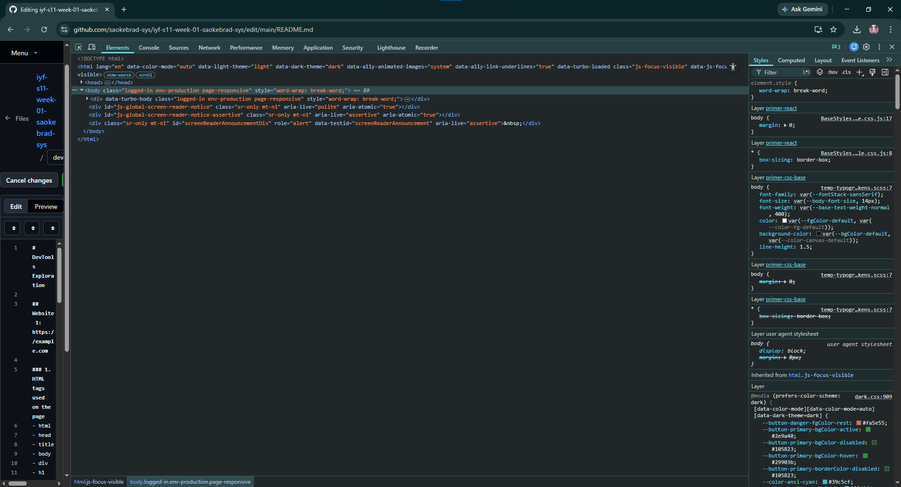

# DevTools Exploration

## Website 1: https://example.com

### 1. HTML tags used on the page
- html
- head
- title
- body
- div
- h1
- p
- a

### 2. Page title
Example Domain

### 3. Number of headings
- 1 heading (<h1>)

## Website 2: https://developer.mozilla.org

### 1. Navigation menu tag
- The navigation menu is wrapped in a <nav> element.

### 2. Search bar structure
- <form>
- <input type="search">
- Search button

### 3. Hover effect on links
- Link color changes when hovered.
- Additional styling such as underline may appear depending on the element.

## Website 3: https://www.wikipedia.org

### 1. Five HTML elements
<header>
- <form>
- <input>
- <button>
- <a>

### 2. Form element and its inputs
Form: Search form

Inputs:
- <input type="search">
- <input type="hidden">

### 3. screenshot

